<p align="center">
  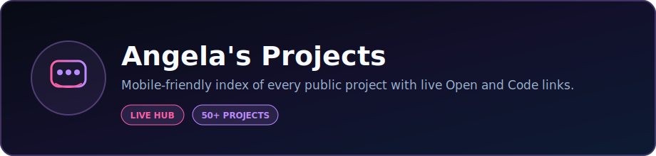
</p>

<p align="center">
  <strong>Mobile-friendly index of every public project with live Open and Code links.</strong>
</p>

<p align="center">
  <a href="https://dacameragirl.github.io/links/"></a>
  <a href="https://github.com/DaCameraGirl/links"></a>
</p>

<p align="center">
  
  
</p>

### Languages

<p align="center">
  
  
  
</p>

### Stack

<p align="center">
  
  
</p>

<p align="center">
  Built by <strong>Angela Hudson</strong> · <a href="https://github.com/DaCameraGirl">DaCameraGirl</a>
</p>
<p align="center"></p>
<p align="center"></p>


| What you want | URL |
|---|---|
| **Use the hub** (tap Open / Code for every project) | **[dacameragirl.github.io/links](https://dacameragirl.github.io/links/)** |
| Read this showcase README on GitHub | `github.com/DaCameraGirl/links` |

GitHub opens the README by default. The **live hub** is a separate page — bookmark the link above or add a desktop shortcut (see below).

**One tap-friendly page for every public thing I've shipped.** Games, kid apps, AI eval tools, dev platforms, and client sites — each with **Open** (try it) and **Code** (repo) links. Private repos stay off the list on purpose.

### Desktop shortcut (Windows)

Double-click to open the live hub in your browser — no terminal needed after setup:

```powershell
powershell -ExecutionPolicy Bypass -File scripts\install-desktop-icon.ps1
```

Creates **Angela's Projects** on your Desktop with a pink/purple hub icon.

<p align="center"></p>
<p align="center"></p>


<p align="center">
  <a href="https://dacameragirl.github.io/links/">
    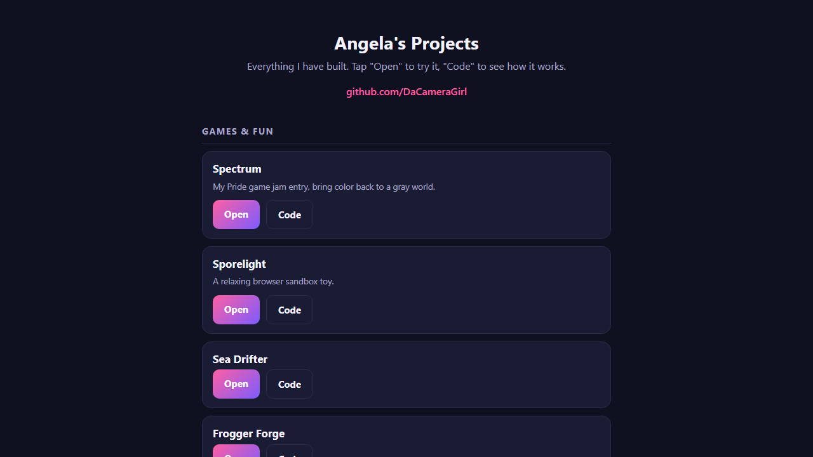
  </a>
</p>

<p align="center"></p>
<p align="center"></p>


<p align="center">
  <a href="https://dacameragirl.github.io/Bettin2Win/">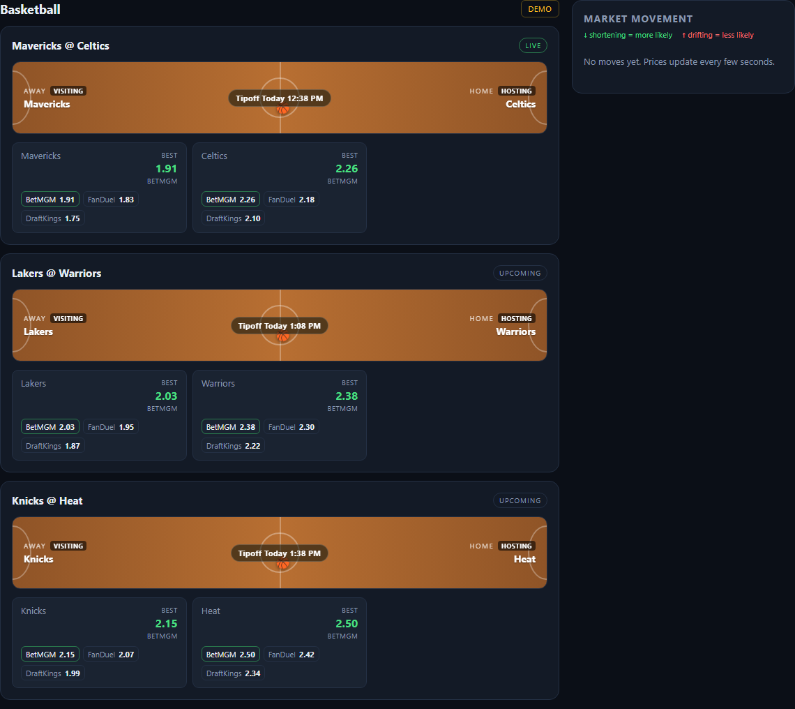</a>
  <a href="https://dacameragirl.github.io/Spectrum/">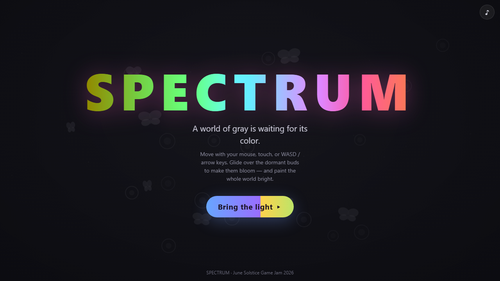</a>
  <a href="https://dacameragirl.github.io/ai-eval-job-radar/">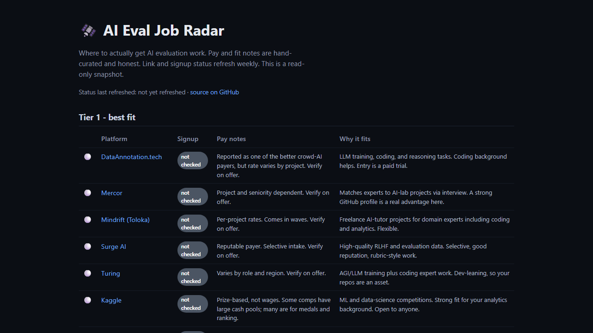</a>
</p>
<p align="center">
  <a href="https://dacameragirl.github.io/AI-Video-Annotator/"></a>
  <a href="https://dacameragirl.github.io/gatekeeper/">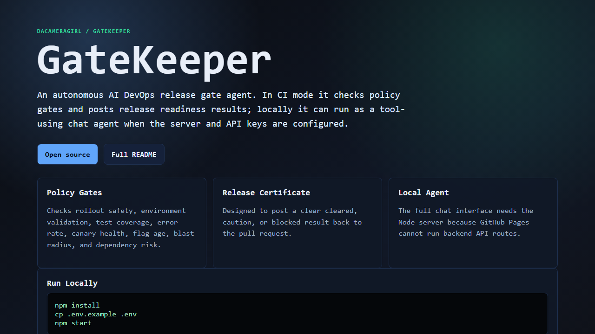</a>
  <a href="https://dacameragirl.github.io/RoseOps-Studio/">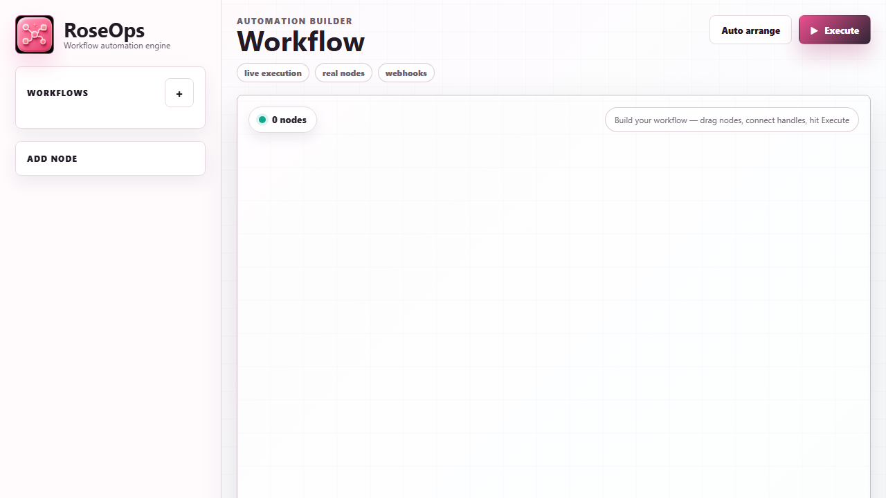</a>
</p>

---

<p align="center"></p>
<p align="center"></p>


<table>
<tr>
<td width="340" valign="top"><a href="https://dacameragirl.github.io/Spectrum/"></a></td>
<td valign="top"><strong>Spectrum</strong><br/>Pride game jam entry — bring color back to a gray world.<br/><br/><a href="https://dacameragirl.github.io/Spectrum/">Open</a> · <a href="https://github.com/DaCameraGirl/Spectrum">Code</a></td>
</tr>
<tr>
<td width="340" valign="top"><a href="https://dacameragirl.github.io/Sporelight/">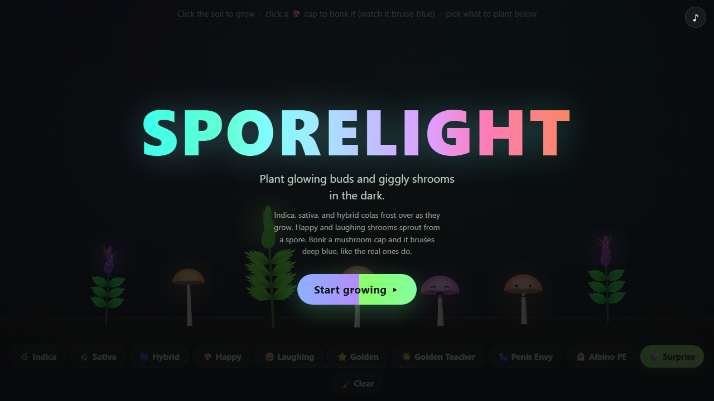</a></td>
<td valign="top"><strong>Sporelight</strong><br/>Relaxing browser sandbox toy.<br/><br/><a href="https://dacameragirl.github.io/Sporelight/">Open</a> · <a href="https://github.com/DaCameraGirl/Sporelight">Code</a></td>
</tr>
<tr>
<td width="340" valign="top"><a href="https://dacameragirl.github.io/sea-drifter/">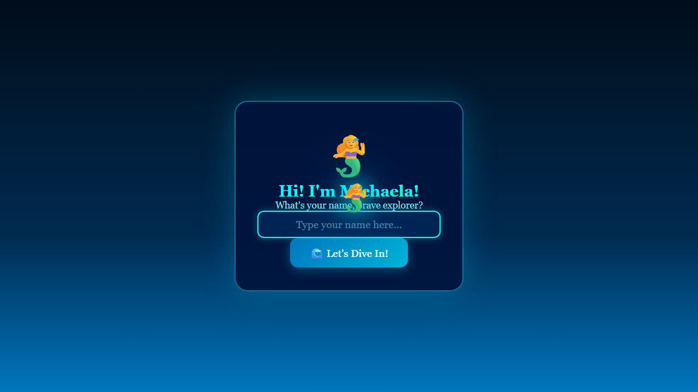</a></td>
<td valign="top"><strong>Sea Drifter</strong><br/>Drift and explore on the open water.<br/><br/><a href="https://dacameragirl.github.io/sea-drifter/">Open</a> · <a href="https://github.com/DaCameraGirl/sea-drifter">Code</a></td>
</tr>
<tr>
<td width="340" valign="top"><a href="https://dacameragirl.github.io/FroggerForge/">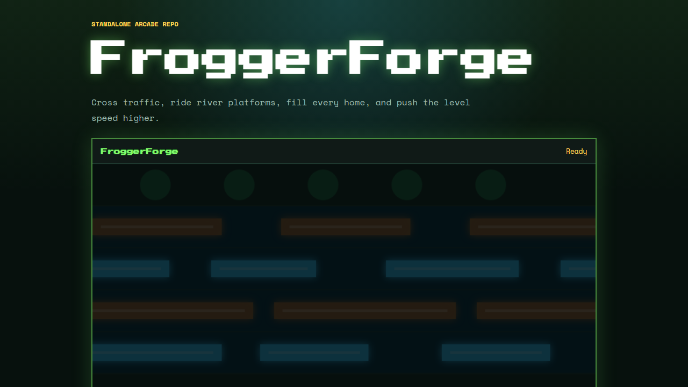</a></td>
<td valign="top"><strong>Frogger Forge</strong><br/>Cross-traffic arcade vibes in the browser.<br/><br/><a href="https://dacameragirl.github.io/FroggerForge/">Open</a> · <a href="https://github.com/DaCameraGirl/FroggerForge">Code</a></td>
</tr>
<tr>
<td width="340" valign="top"><a href="https://dacameragirl.github.io/floating-panda-dream/">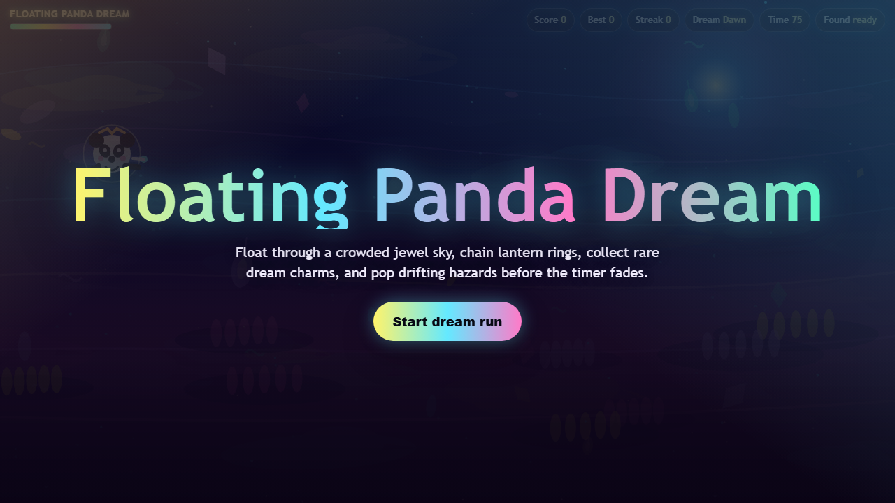</a></td>
<td valign="top"><strong>Floating Panda Dream</strong><br/>Soft, dreamy panda float game.<br/><br/><a href="https://dacameragirl.github.io/floating-panda-dream/">Open</a> · <a href="https://github.com/DaCameraGirl/floating-panda-dream">Code</a></td>
</tr>
<tr>
<td width="340" valign="top"><a href="https://dacameragirl.github.io/pixelforge/">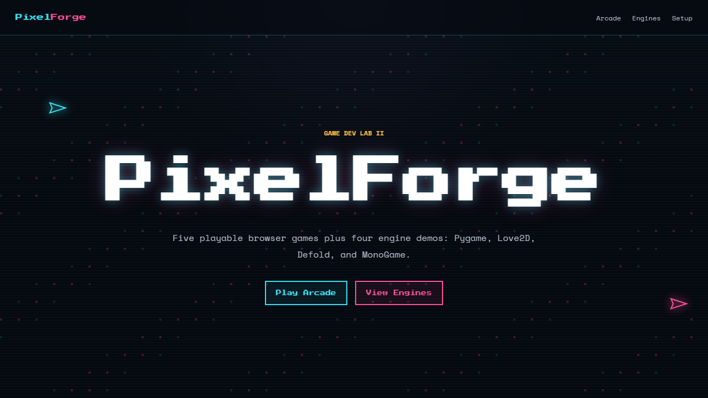</a></td>
<td valign="top"><strong>PixelForge</strong><br/>Pixel art / forge playground.<br/><br/><a href="https://dacameragirl.github.io/pixelforge/">Open</a> · <a href="https://github.com/DaCameraGirl/pixelforge">Code</a></td>
</tr>
<tr>
<td width="340" valign="top"><a href="https://dacameragirl.github.io/game-engine-lab/">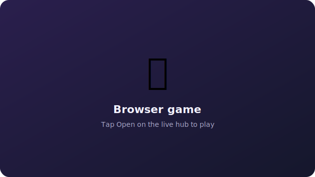</a></td>
<td valign="top"><strong>Game Engine Lab</strong><br/>Experiments with browser game engines.<br/><br/><a href="https://dacameragirl.github.io/game-engine-lab/">Open</a> · <a href="https://github.com/DaCameraGirl/game-engine-lab">Code</a></td>
</tr>
<tr>
<td width="340" valign="top"><a href="https://dacameragirl.github.io/MiniMe/"></a></td>
<td valign="top"><strong>MiniMe</strong><br/>Mini character builder / toy.<br/><br/><a href="https://dacameragirl.github.io/MiniMe/">Open</a> · <a href="https://github.com/DaCameraGirl/MiniMe">Code</a></td>
</tr>
<tr>
<td width="340" valign="top"><a href="https://dacameragirl.github.io/LostLittleGirl/"></a></td>
<td valign="top"><strong>Lost Little Girl</strong><br/>Story-driven browser adventure.<br/><br/><a href="https://dacameragirl.github.io/LostLittleGirl/">Open</a> · <a href="https://github.com/DaCameraGirl/LostLittleGirl">Code</a></td>
</tr>
<tr>
<td width="340" valign="top"><a href="https://dacameragirl.github.io/Chloe_On_A_Pedastal/"></a></td>
<td valign="top"><strong>Chloe On A Pedestal</strong><br/>Puzzle / platform experiment.<br/><br/><a href="https://dacameragirl.github.io/Chloe_On_A_Pedastal/">Open</a> · <a href="https://github.com/DaCameraGirl/Chloe_On_A_Pedastal">Code</a></td>
</tr>
<tr>
<td width="340" valign="top"><a href="https://dacameragirl.github.io/quantum-command-52/">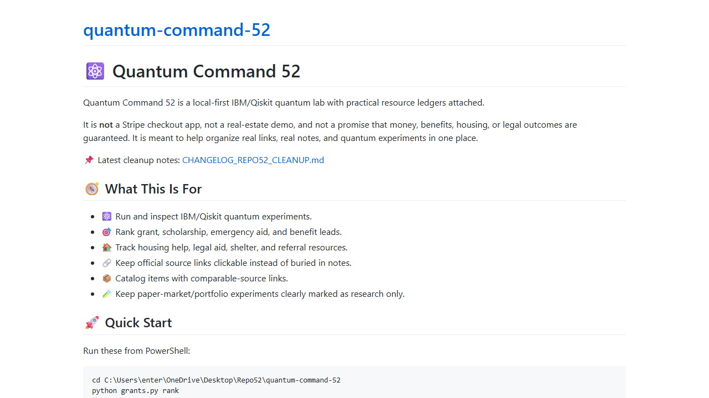</a></td>
<td valign="top"><strong>Quantum Command 52</strong><br/>Sci-fi command deck game.<br/><br/><a href="https://dacameragirl.github.io/quantum-command-52/">Open</a> · <a href="https://github.com/DaCameraGirl/quantum-command-52">Code</a></td>
</tr>
<tr>
<td width="340" valign="top"><a href="https://dacameragirl.github.io/pride-game-jam-2026/">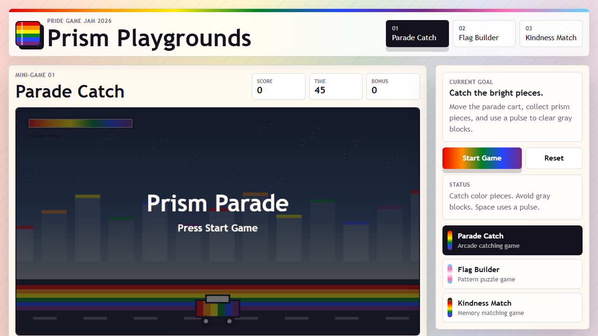</a></td>
<td valign="top"><strong>Pride Game Jam 2026</strong><br/>Jam collection / showcase.<br/><br/><a href="https://dacameragirl.github.io/pride-game-jam-2026/">Open</a> · <a href="https://github.com/DaCameraGirl/pride-game-jam-2026">Code</a></td>
</tr>
</table>

<p align="center"></p>
<p align="center"></p>


<table>
<tr>
<td width="340" valign="top"><a href="https://dacameragirl.github.io/Jaxons-Rhyming-Clock/">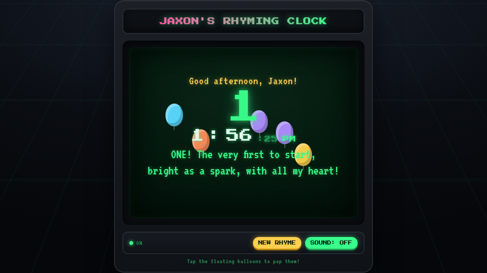</a></td>
<td valign="top"><strong>Jaxon's Rhyming Clock</strong><br/>Retro arcade clock that teaches numbers and telling time.<br/><br/><a href="https://dacameragirl.github.io/Jaxons-Rhyming-Clock/">Open</a> · <a href="https://github.com/DaCameraGirl/Jaxons-Rhyming-Clock">Code</a></td>
</tr>
<tr>
<td width="340" valign="top"><a href="https://dacameragirl.github.io/Jaxons-Number-Genius-Lab/">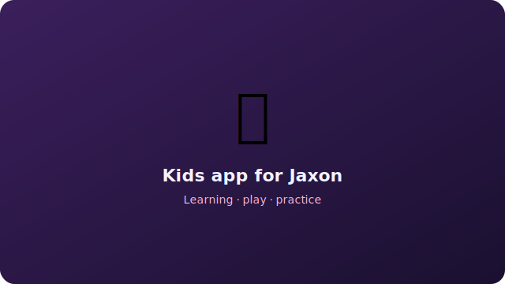</a></td>
<td valign="top"><strong>Jaxon's Number Genius Lab</strong><br/>Number sense drills and mini labs.<br/><br/><a href="https://dacameragirl.github.io/Jaxons-Number-Genius-Lab/">Open</a> · <a href="https://github.com/DaCameraGirl/Jaxons-Number-Genius-Lab">Code</a></td>
</tr>
<tr>
<td width="340" valign="top"><a href="https://dacameragirl.github.io/Jaxons-Numbers-Games/"></a></td>
<td valign="top"><strong>Jaxon's Numbers Games</strong><br/>Quick number games bundle.<br/><br/><a href="https://dacameragirl.github.io/Jaxons-Numbers-Games/">Open</a> · <a href="https://github.com/DaCameraGirl/Jaxons-Numbers-Games">Code</a></td>
</tr>
<tr>
<td width="340" valign="top"><a href="https://dacameragirl.github.io/Jaxons_Potty_Time/">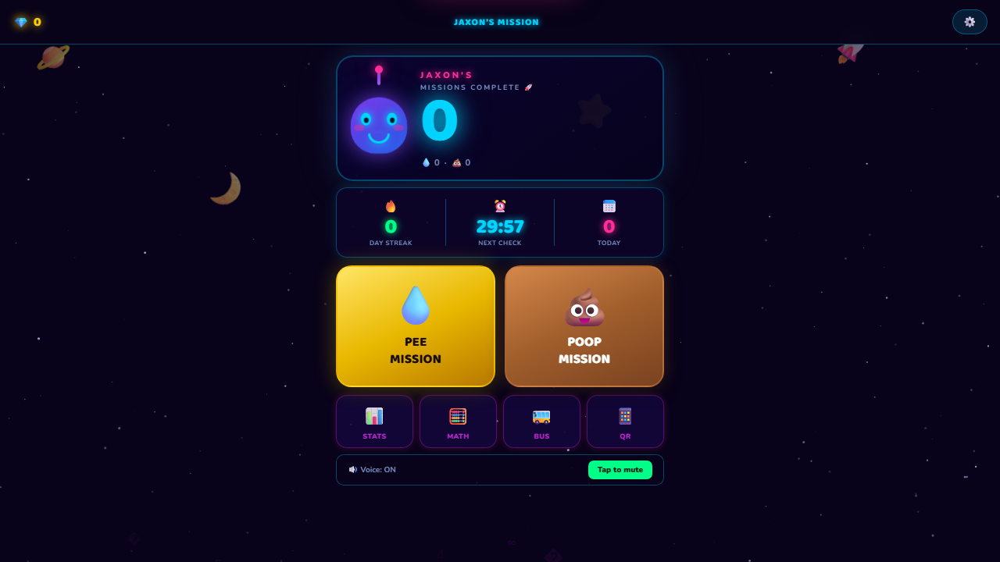</a></td>
<td valign="top"><strong>Jaxon's Potty Time</strong><br/>Space-themed potty-training game.<br/><br/><a href="https://dacameragirl.github.io/Jaxons_Potty_Time/">Open</a> · <a href="https://github.com/DaCameraGirl/Jaxons_Potty_Time">Code</a></td>
</tr>
<tr>
<td width="340" valign="top"><a href="https://dacameragirl.github.io/math-bingo/">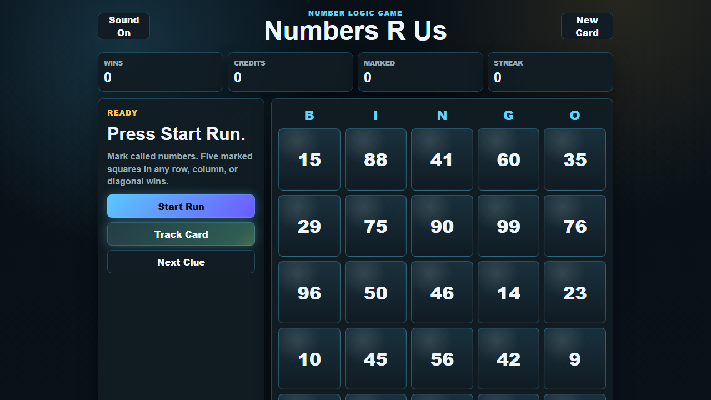</a></td>
<td valign="top"><strong>Math Bingo</strong><br/>Bingo board for early math practice.<br/><br/><a href="https://dacameragirl.github.io/math-bingo/">Open</a> · <a href="https://github.com/DaCameraGirl/math-bingo">Code</a></td>
</tr>
</table>

<p align="center"></p>
<p align="center"></p>


<table>
<tr>
<td width="340" valign="top"><a href="https://dacameragirl.github.io/ai-eval-job-radar/"></a></td>
<td valign="top"><strong>AI Eval Job Radar</strong><br/>Self-updating tracker for AI evaluation and training jobs.<br/><br/><a href="https://dacameragirl.github.io/ai-eval-job-radar/">Open</a> · <a href="https://github.com/DaCameraGirl/ai-eval-job-radar">Code</a></td>
</tr>
<tr>
<td width="340" valign="top"><a href="https://dacameragirl.github.io/AI-Video-Annotator/"></a></td>
<td valign="top"><strong>AI Video Annotator</strong><br/>In-browser warehouse object annotator.<br/><br/><a href="https://dacameragirl.github.io/AI-Video-Annotator/">Open</a> · <a href="https://github.com/DaCameraGirl/AI-Video-Annotator">Code</a></td>
</tr>
<tr>
<td width="340" valign="top">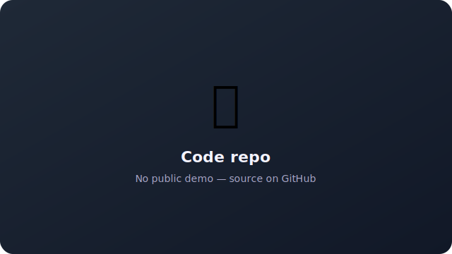</td>
<td valign="top"><strong>Hydra Evaluator App</strong><br/>Image-edit model evaluation tool (repo only).<br/><br/><a href="https://github.com/DaCameraGirl/hydra-evaluator-app">Code</a></td>
</tr>
<tr>
<td width="340" valign="top"><a href="https://dacameragirl.github.io/selection-improvement-experts/">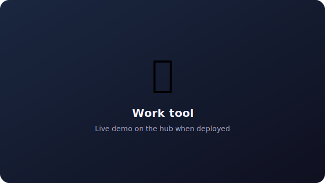</a></td>
<td valign="top"><strong>Selection Improvement Experts</strong><br/>Expert-panel style option review.<br/><br/><a href="https://dacameragirl.github.io/selection-improvement-experts/">Open</a> · <a href="https://github.com/DaCameraGirl/selection-improvement-experts">Code</a></td>
</tr>
<tr>
<td width="340" valign="top"><a href="https://dacameragirl.github.io/my-Job_Assistant/"></a></td>
<td valign="top"><strong>My Job Assistant</strong><br/>Job search / application helper.<br/><br/><a href="https://dacameragirl.github.io/my-Job_Assistant/">Open</a> · <a href="https://github.com/DaCameraGirl/my-Job_Assistant">Code</a></td>
</tr>
<tr>
<td width="340" valign="top"><a href="https://dacameragirl.github.io/Quality_Trainer/"></a></td>
<td valign="top"><strong>Quality Trainer</strong><br/>Rubric and quality coaching UI.<br/><br/><a href="https://dacameragirl.github.io/Quality_Trainer/">Open</a> · <a href="https://github.com/DaCameraGirl/Quality_Trainer">Code</a></td>
</tr>
<tr>
<td width="340" valign="top"><a href="https://dacameragirl.github.io/OpenClaw-Experts/"></a></td>
<td valign="top"><strong>OpenClaw Experts</strong><br/>OpenClaw expert workflow surface.<br/><br/><a href="https://dacameragirl.github.io/OpenClaw-Experts/">Open</a> · <a href="https://github.com/DaCameraGirl/OpenClaw-Experts">Code</a></td>
</tr>
<tr>
<td width="340" valign="top"><a href="https://dacameragirl.github.io/OpenClaw-Interactive/"></a></td>
<td valign="top"><strong>OpenClaw Interactive</strong><br/>Interactive OpenClaw training UI.<br/><br/><a href="https://dacameragirl.github.io/OpenClaw-Interactive/">Open</a> · <a href="https://github.com/DaCameraGirl/OpenClaw-Interactive">Code</a></td>
</tr>
<tr>
<td width="340" valign="top"><a href="https://dacameragirl.github.io/OpenClaw-Academy/">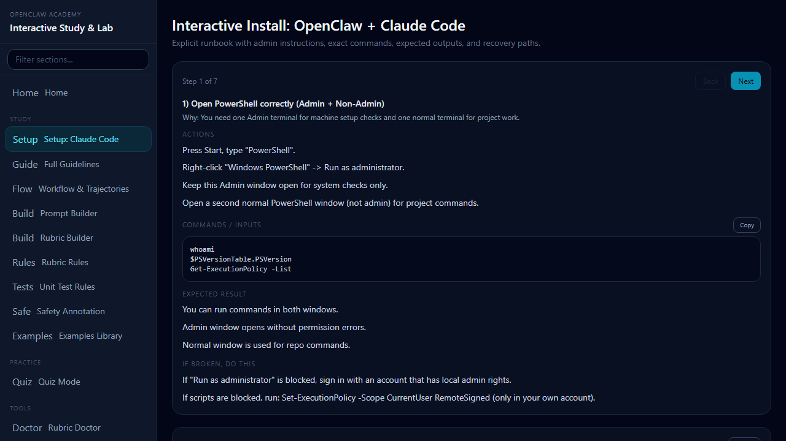</a></td>
<td valign="top"><strong>OpenClaw Academy</strong><br/>OpenClaw learning hub.<br/><br/><a href="https://dacameragirl.github.io/OpenClaw-Academy/">Open</a> · <a href="https://github.com/DaCameraGirl/OpenClaw-Academy">Code</a></td>
</tr>
<tr>
<td width="340" valign="top"></td>
<td valign="top"><strong>Warehouse Caption Checker</strong><br/>Caption QA for warehouse video (repo only).<br/><br/><a href="https://github.com/DaCameraGirl/Warehouse-Caption-Checker">Code</a></td>
</tr>
<tr>
<td width="340" valign="top"></td>
<td valign="top"><strong>Warehouse Annotator</strong><br/>Warehouse annotation utilities (repo only).<br/><br/><a href="https://github.com/DaCameraGirl/Warehouse-Annotator">Code</a></td>
</tr>
<tr>
<td width="340" valign="top"><a href="https://dacameragirl.github.io/gatekeeper/"></a></td>
<td valign="top"><strong>GateKeeper</strong><br/>Autonomous AI DevOps release-gate agent.<br/><br/><a href="https://dacameragirl.github.io/gatekeeper/">Open</a> · <a href="https://github.com/DaCameraGirl/gatekeeper">Code</a></td>
</tr>
<tr>
<td width="340" valign="top"></td>
<td valign="top"><strong>Grok's Desk</strong><br/>Grok + Angela session log — what we shipped on RoseOps, Bettin2Win, Obsidian.<br/><br/><a href="https://dacameragirl.github.io/groks-work/">Open</a> · <a href="https://github.com/DaCameraGirl/groks-work">Code</a></td>
</tr>
</table>

<p align="center"></p>
<p align="center"></p>


<table>
<tr>
<td width="340" valign="top"><a href="https://www.compassultra.com/"></a></td>
<td valign="top"><strong>Compass Ultra</strong><br/>Release readiness platform.<br/><br/><a href="https://www.compassultra.com/">Open</a> · <a href="https://github.com/DaCameraGirl/Compass-Ultra">Code</a></td>
</tr>
<tr>
<td width="340" valign="top"><a href="https://dacameragirl.github.io/Compass-Ultra-Web-Intel/">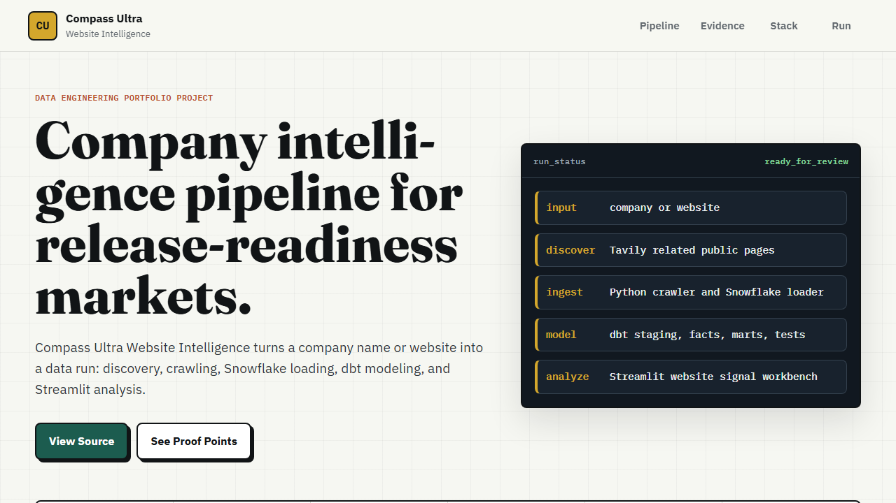</a></td>
<td valign="top"><strong>Compass Ultra Web Intel</strong><br/>Web intelligence layer for Compass Ultra.<br/><br/><a href="https://dacameragirl.github.io/Compass-Ultra-Web-Intel/">Open</a> · <a href="https://github.com/DaCameraGirl/Compass-Ultra-Web-Intel">Code</a></td>
</tr>
<tr>
<td width="340" valign="top"><a href="https://dacameragirl.github.io/Compass-Ultra-AI-Dev-Ops/"></a></td>
<td valign="top"><strong>Compass Ultra AI DevOps</strong><br/>AI-assisted DevOps companion.<br/><br/><a href="https://dacameragirl.github.io/Compass-Ultra-AI-Dev-Ops/">Open</a> · <a href="https://github.com/DaCameraGirl/Compass-Ultra-AI-Dev-Ops">Code</a></td>
</tr>
<tr>
<td width="340" valign="top"><a href="https://dacameragirl.github.io/dicom-forge/"></a></td>
<td valign="top"><strong>DICOM Forge</strong><br/>Medical imaging pipeline.<br/><br/><a href="https://dacameragirl.github.io/dicom-forge/">Open</a> · <a href="https://github.com/DaCameraGirl/dicom-forge">Code</a></td>
</tr>
<tr>
<td width="340" valign="top"><a href="https://dacameragirl.github.io/slicer-forge/"></a></td>
<td valign="top"><strong>Slicer Forge</strong><br/>3D Slicer extension workbench.<br/><br/><a href="https://dacameragirl.github.io/slicer-forge/">Open</a> · <a href="https://github.com/DaCameraGirl/slicer-forge">Code</a></td>
</tr>
<tr>
<td width="340" valign="top"><a href="https://dacameragirl.github.io/agent-platform/"></a></td>
<td valign="top"><strong>Agent Platform</strong><br/>Agent orchestration scaffold.<br/><br/><a href="https://dacameragirl.github.io/agent-platform/">Open</a> · <a href="https://github.com/DaCameraGirl/agent-platform">Code</a></td>
</tr>
<tr>
<td width="340" valign="top"><a href="https://dacameragirl.github.io/vibe-coding-platform/"></a></td>
<td valign="top"><strong>Vibe Coding Platform</strong><br/>Vibe-driven coding workspace.<br/><br/><a href="https://dacameragirl.github.io/vibe-coding-platform/">Open</a> · <a href="https://github.com/DaCameraGirl/vibe-coding-platform">Code</a></td>
</tr>
<tr>
<td width="340" valign="top"><a href="https://dacameragirl.github.io/launchpad/"></a></td>
<td valign="top"><strong>Launchpad</strong><br/>Project launch scaffold.<br/><br/><a href="https://dacameragirl.github.io/launchpad/">Open</a> · <a href="https://github.com/DaCameraGirl/launchpad">Code</a></td>
</tr>
<tr>
<td width="340" valign="top"><a href="https://dacameragirl.github.io/telemetry-flag-adapter/"></a></td>
<td valign="top"><strong>Telemetry Flag Adapter</strong><br/>Feature-flag telemetry bridge.<br/><br/><a href="https://dacameragirl.github.io/telemetry-flag-adapter/">Open</a> · <a href="https://github.com/DaCameraGirl/telemetry-flag-adapter">Code</a></td>
</tr>
<tr>
<td width="340" valign="top"><a href="https://dacameragirl.github.io/RoseOps-Studio/"></a></td>
<td valign="top"><strong>RoseOps Studio</strong><br/>Workflow automation builder.<br/><br/><a href="https://dacameragirl.github.io/RoseOps-Studio/">Open</a> · <a href="https://github.com/DaCameraGirl/RoseOps-Studio">Code</a></td>
</tr>
<tr>
<td width="340" valign="top"><a href="https://dacameragirl.github.io/libre-design-workspace/"></a></td>
<td valign="top"><strong>Libre Design Workspace</strong><br/>Open design tooling workspace.<br/><br/><a href="https://dacameragirl.github.io/libre-design-workspace/">Open</a> · <a href="https://github.com/DaCameraGirl/libre-design-workspace">Code</a></td>
</tr>
<tr>
<td width="340" valign="top"><a href="https://dacameragirl.github.io/vibecut-studio/"></a></td>
<td valign="top"><strong>VibeCut Studio</strong><br/>AI media production studio.<br/><br/><a href="https://dacameragirl.github.io/vibecut-studio/">Open</a> · <a href="https://github.com/DaCameraGirl/vibecut-studio">Code</a></td>
</tr>
<tr>
<td width="340" valign="top"><a href="https://dacameragirl.github.io/license-zapper/"></a></td>
<td valign="top"><strong>License Zapper</strong><br/>License scanning / cleanup helper.<br/><br/><a href="https://dacameragirl.github.io/license-zapper/">Open</a> · <a href="https://github.com/DaCameraGirl/license-zapper">Code</a></td>
</tr>
<tr>
<td width="340" valign="top"><a href="https://dacameragirl.github.io/payload-revealer/"></a></td>
<td valign="top"><strong>Payload Revealer</strong><br/>Inspect and reveal API payloads.<br/><br/><a href="https://dacameragirl.github.io/payload-revealer/">Open</a> · <a href="https://github.com/DaCameraGirl/payload-revealer">Code</a></td>
</tr>
<tr>
<td width="340" valign="top"><a href="https://dacameragirl.github.io/Public-Profile-Finder/"></a></td>
<td valign="top"><strong>Public Profile Finder</strong><br/>Find public profiles across platforms.<br/><br/><a href="https://dacameragirl.github.io/Public-Profile-Finder/">Open</a> · <a href="https://github.com/DaCameraGirl/Public-Profile-Finder">Code</a></td>
</tr>
<tr>
<td width="340" valign="top"><a href="https://dacameragirl.github.io/Pre-Flight_Checklist/"></a></td>
<td valign="top"><strong>Pre-Flight Checklist</strong><br/>Release pre-flight checks.<br/><br/><a href="https://dacameragirl.github.io/Pre-Flight_Checklist/">Open</a> · <a href="https://github.com/DaCameraGirl/Pre-Flight_Checklist">Code</a></td>
</tr>
<tr>
<td width="340" valign="top"><a href="https://dacameragirl.github.io/time-tracker/"></a></td>
<td valign="top"><strong>Time Tracker</strong><br/>Simple time tracking UI.<br/><br/><a href="https://dacameragirl.github.io/time-tracker/">Open</a> · <a href="https://github.com/DaCameraGirl/time-tracker">Code</a></td>
</tr>
<tr>
<td width="340" valign="top"><a href="https://dacameragirl.github.io/Project101/"></a></td>
<td valign="top"><strong>Project101</strong><br/>Starter project template hub.<br/><br/><a href="https://dacameragirl.github.io/Project101/">Open</a> · <a href="https://github.com/DaCameraGirl/Project101">Code</a></td>
</tr>
<tr>
<td width="340" valign="top"><a href="https://dacameragirl.github.io/AdamSinAndSaintProtocol/"></a></td>
<td valign="top"><strong>Adam Sin And Saint Protocol</strong><br/>Dual-chain forensic clarity engine.<br/><br/><a href="https://dacameragirl.github.io/AdamSinAndSaintProtocol/">Open</a> · <a href="https://github.com/DaCameraGirl/AdamSinAndSaintProtocol">Code</a></td>
</tr>
<tr>
<td width="340" valign="top"><a href="https://dacameragirl.github.io/angel-gates/"></a></td>
<td valign="top"><strong>Angel Gates</strong><br/>Gate access and incident-evidence add-on.<br/><br/><a href="https://dacameragirl.github.io/angel-gates/">Open</a> · <a href="https://github.com/DaCameraGirl/angel-gates">Code</a></td>
</tr>
</table>

<p align="center"></p>
<p align="center"></p>


<table>
<tr>
<td width="340" valign="top"><a href="https://dacameragirl.github.io/shawns-pressure-washing/">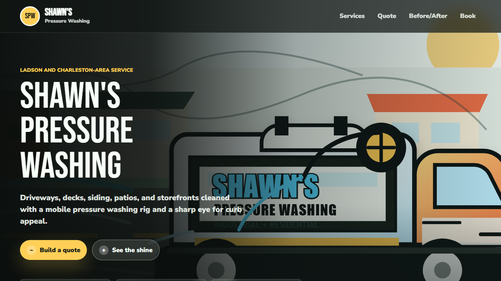</a></td>
<td valign="top"><strong>Shawn's Pressure Washing</strong><br/>Local service landing page.<br/><br/><a href="https://dacameragirl.github.io/shawns-pressure-washing/">Open</a> · <a href="https://github.com/DaCameraGirl/shawns-pressure-washing">Code</a></td>
</tr>
<tr>
<td width="340" valign="top"><a href="https://dacameragirl.github.io/andys-woodworks/">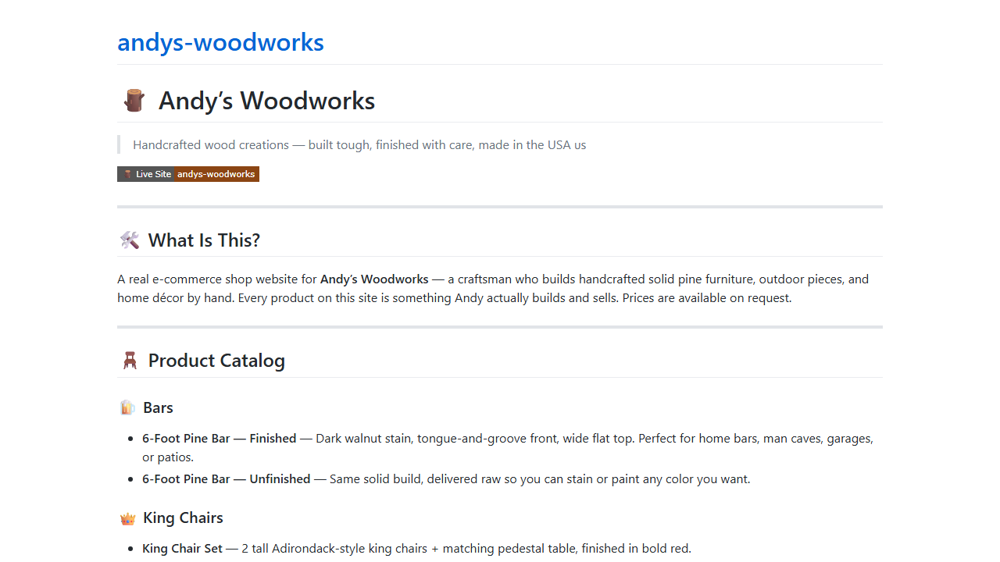</a></td>
<td valign="top"><strong>Andy's Woodworks</strong><br/>Woodworking business site.<br/><br/><a href="https://dacameragirl.github.io/andys-woodworks/">Open</a> · <a href="https://github.com/DaCameraGirl/andys-woodworks">Code</a></td>
</tr>
<tr>
<td width="340" valign="top"><a href="https://dacameragirl.github.io/Bettin2Win/"></a></td>
<td valign="top"><strong>Bettin2Win</strong><br/>Beginner odds guide — live lines, plain-English explainers, not a sportsbook.<br/><br/><a href="https://dacameragirl.github.io/Bettin2Win/">Open</a> · <a href="https://github.com/DaCameraGirl/Bettin2Win">Code</a></td>
</tr>
</table>

---

<p align="center"></p>
<p align="center"></p>


| File | Purpose |
|---|---|
| `index.html` | The live hub page (static, no build step) |
| `docs/previews/` | README screenshots — live captures + category fallbacks |
| `scripts/capture-previews.mjs` | Playwright capture for apps/tools |
| `scripts/capture-games.mjs` | Playwright capture for games/kids apps |

Regenerate previews after UI changes:

```bash
npm install
npx playwright install chromium
npm run screenshots
```

<p align="center"></p>
<p align="center"></p>


- Only **public** repos with working demos belong on the hub.
- Links were verified (HTTP 200) before the hub went live.
- Private repos are excluded so visitors never hit a 404.

<p align="center">
  Built by <strong>Angela Hudson</strong> · <a href="https://github.com/DaCameraGirl">github.com/DaCameraGirl</a>
</p>